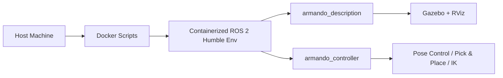

# armando_sim

🤖 **Simulation workspace for Armando, a 4-DOF robotic arm in ROS 2 Humble.**

## 📚 Index

- [Overview](#overview)
- [Repository Structure](#repository-structure)
- [Docker Environment](#docker-environment)
- [ROS 2 Packages in `src`](#ros-2-packages-in-src)
- [Quick Start](#quick-start)

---

## Overview

This repository contains the core packages used to simulate **Armando**, a 4-DOF robotic arm developed for educational and research purposes.

The project has two main goals:

1. **Technical reference**: document the software architecture and runtime logic of the robotic arm in a ROS 2 Humble environment.
2. **Operational guide**: provide a practical workflow for developing, extending, and testing a generic robotic manipulator in simulation before deploying software to real hardware.

The repository is designed to provide a reproducible development environment based on Docker, reducing host-side dependency conflicts and making the simulation stack easier to share across different machines.

---

## 🧭 At-a-Glance Workflow



---

## Repository Structure

The workspace is organized around two main directories:

- **`docker_scripts/`**: scripts and configuration used to build, run, and access the Docker-based development environment.
- **`src/`**: ROS 2 packages and simulation assets, including robot description, controllers, sensors, worlds, and launch files.

This setup keeps the host system clean while giving every developer the same execution environment.

### 🗂️ Structure Scheme

```
armando_sim/
├── docker_scripts/
│   ├── Dockerfile
│   ├── docker_build_image.sh
│   ├── docker_run_container.sh
│   └── docker_connect.sh
└── src/
    ├── armando_description/
    └── armando_controller/
```

---

## Docker Environment

The `docker_scripts/` directory contains the automation needed to manage the container lifecycle.

| File | Purpose |
| --- | --- |
| **`Dockerfile`** | Defines the base image built around Ubuntu 22.04 and ROS 2 Humble, installs Gazebo Harmonic support, and prepares the workspace used inside the container. |
| **`docker_build_image.sh`** | Builds the Docker image. Run it the first time and whenever the Dockerfile changes. |
| **`docker_run_container.sh`** | Starts the container and configures X11 forwarding so GUI applications such as Gazebo and RViz can run from inside the container. |
| **`docker_connect.sh`** | Opens an additional shell inside a running container, which is useful for monitoring topics or running commands in parallel. |

### Why Docker Is Used

Containerization is a technical choice, not just a convenience feature. It provides:

1. **Isolation**: every developer uses the same versions of ROS 2, Gazebo, and related dependencies.
2. **Faster setup**: environment provisioning takes minutes instead of manually reproducing a full robotics stack.
3. **Portability**: software developed in simulation can be transferred more reliably to the onboard computer used on the real robot.

---

## ROS 2 Packages in `src`

The `src/` directory contains the main ROS 2 packages that define the **Armando** simulation stack. The workspace is split into two complementary modules: one focused on robot modeling and simulation assets, and one focused on control.

### armando_description

This package defines the physical and visual representation of the robot. It includes the URDF/Xacro description, simulated sensors, Gazebo worlds, RViz configuration, and launch files.

#### Main contents

- **`urdf/`**: Xacro files describing the robotic arm, including links, joints, and sensor definitions.
- **`meshes/`** and **`models/`**: 3D geometry and simulation assets for the robot and the environment.
- **`worlds/`**: SDF worlds used in simulation (e.g., a workbench environment).
- **`launch/`**: launch files used to start the robot description stack, Gazebo, and RViz.
- **`config/`**: RViz and controller configuration files for a ready-to-use visualization setup.
- **`CMakeLists.txt`** and **`package.xml`**: build configuration and package metadata.

#### Launch files

The `armando_description` package includes two main launch files that coordinate the startup of the software environment. Although they are commonly used together, they serve different purposes:

- **`armando_gazebo.launch.py`**: Manages the physical simulation environment in **Gazebo Harmonic**. It computes the robot dynamics, simulates sensors, and loads the virtual world (`.sdf`). It is the simulation engine that generates the runtime data.

```bash
ros2 launch armando_description armando_gazebo.launch.py
```

- **`armando_rviz.launch.py`**: Starts the monitoring and visualization interface in **RViz2**. It does not simulate physics; instead, it subscribes to runtime topics such as TF transforms and camera data, and renders them in a 3D view for the operator.

```bash
ros2 launch armando_description armando_rviz.launch.py
```

---

### armando_controller

This package implements the control logic for the Armando robot. It provides three distinct control modes, from simple predefined poses to full visual servoing via inverse kinematics.

#### Main contents

- **`src/`**: C++ source files for controller nodes.
- **`include/`**: C++ header files.
- **`config/`**: YAML configuration files for poses and controller parameters.
- **`launch/`**: launch files for complex control pipelines (e.g., IK with camera).
- **`CMakeLists.txt`** and **`package.xml`**: build configuration and package metadata.

#### Control modes

**1. Predefined Pose Control**

Sends the robot to specific joint configurations saved in `config/poses.yaml`. It uses an Action Client to ensure smooth and synchronized movements.

```bash
ros2 run armando_controller armando_controller_node --ros-args -p pose:="pos0"
```

> Replace `pos0` with the desired pose name, or use `home` to reset the arm to the zero position.

**2. Automated Pick & Place**

Executes a timed, automated Pick & Place sequence. The robot moves between predefined poses and activates or deactivates Gazebo gripper plugins to grab and release objects.

```bash
ros2 run armando_controller armando_pick_place_node
```

Manual gripper control is also available via topics:

```bash
# Attach cube A (ID 0)
ros2 topic pub --once /gripper/attach_a std_msgs/msg/Empty "{}"

# Detach cube A (ID 0)
ros2 topic pub --once /gripper/detach_a std_msgs/msg/Empty "{}"
```

> Cube mapping: `a = ID 0`, `b = ID 1`, `c = ID 2`, `d = ID 3`.

**3. Dynamic IK Control**

Uses analytical Inverse Kinematics to reach targets (ArUco markers) detected by the onboard camera. The target can be changed at runtime without restarting the node.

```bash
ros2 launch armando_controller armando_ik.launch.py
```

To change the tracked target at runtime:

```bash
ros2 param set /armando_ik_node target_id 2
```

> Use the desired marker ID, or `-1` to return the arm to the Home position.

#### Useful commands

**Send the robot to the Home position manually via the Action Server:**

```bash
ros2 action send_goal /joint_trajectory_controller/follow_joint_trajectory control_msgs/action/FollowJointTrajectory "{
    trajectory: {
        joint_names: ['j0', 'j1', 'j2', 'j3'],
        points: [{
            positions: [0.0, 0.0, 0.0, 0.0],
            velocities: [0.0, 0.0, 0.0, 0.0],
            time_from_start: {sec: 2, nanosec: 0}
        }]
    }
}"
```

Alternatively, using the controller node:

```bash
ros2 run armando_controller armando_controller_node --ros-args -p pose:="home"
```

---

## Quick Start

To prepare and launch the environment for the first time:

```bash
chmod +x docker_scripts/*.sh
./docker_scripts/docker_build_image.sh
./docker_scripts/docker_run_container.sh
```

Once the container is running, you can attach additional shells with:

```bash
./docker_scripts/docker_connect.sh
```

Inside the container, start RViz and Gazebo:

```bash
ros2 launch armando_description armando_rviz.launch.py
ros2 launch armando_description armando_gazebo.launch.py
```

Now Armando is running inside the simulation environment. You can send it to predefined poses, run automated Pick & Place sequences, or use the IK node with ArUco marker tracking as described above.